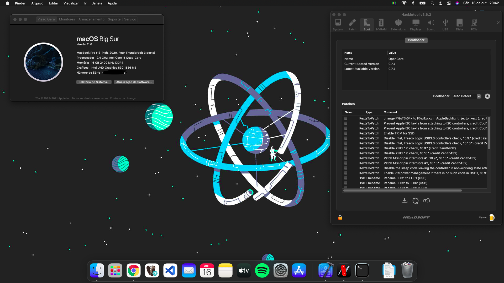
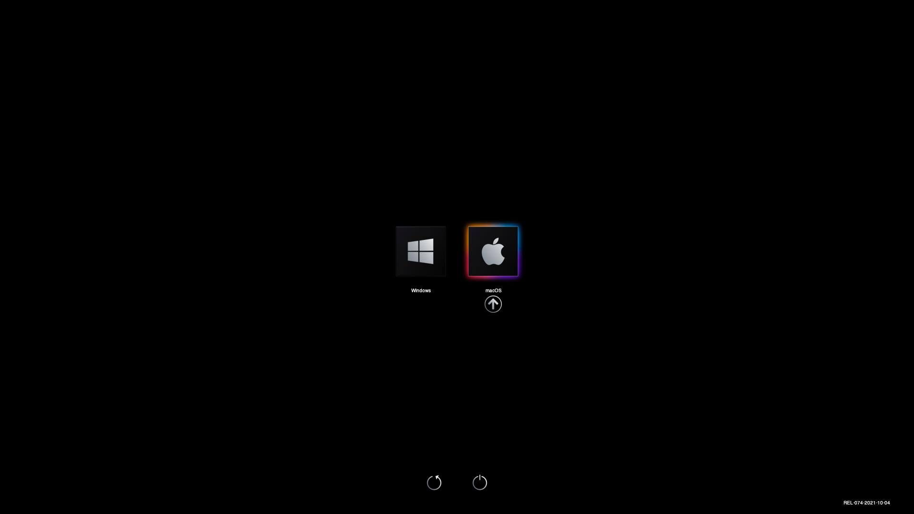
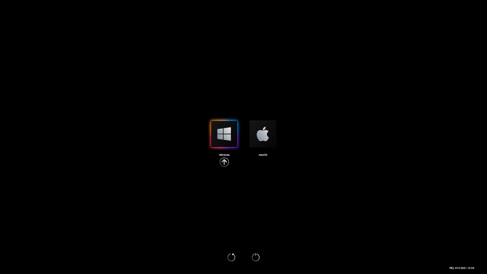

# Acer Nitro 5 AN515-54 Hackintosh (OpenCore 0.7.4)

#### Suporte a MacOS Monterey 12.0 Beta (Se houver crash, volte pro BigSur)

    
  
  

 

## Tópicos 

[Detalhes do Sistema](#detalhes-do-sistema)

[O que funciona](#o-que-funciona)

[O que não funciona](#o-que-não-funciona)

[Importante](#importante)

[Licença](#licença)

 

## Detalhes do Sistema

| Model            | Acer Nitro 5 AN515-54-58CL 15"                               |
| :--------------- | :----------------------------------------------------------- |
| Processor        | Intel i5-9300H                                               |
| GPU              | Intel UHD Graphics 630 & NVIDIA GeForce® GTX 1650 (Disabled) |
| Memory           | 2x 2666MHz DDR4 8GB HYPERX IMPACT                            |
| SSD              | 1x XPG S41 TUF NVMe SSD 512 GB & 1x HD SATA 1TB              |
| WiFi / BT        | Intel AX200 WI-FI 6                                          |
| Audio            | Realtek ALC255                                               |
| Touchpad         | ELAN 0504                                                    |
| BIOS Version     | 1.33                                                         |
| OpenCore Version | 0.7.4                                                        |

 

#### Suporte a MacOS 11.6.0

 

## O que funciona:

- P2(Audio/Mic) 👉🏻 See P2_bugfix.zip ✅;
- Wi-fi ✅;
- Bluetooth ✅;
- Trackpad ✅;
- Intel UHD Graphics 630 ✅;
- Webcam ✅;
- Audio ✅;
- Microfone ✅;
- Rede Ethernet ✅;
- Todas as portas USB ✅;
- Teclado e comandos fn ✅.

 

## O que não funciona:

- HDMI (HDMI é controlado pela GeForce® GTX 1650, que não tem suporte, pode usar um adaptador) ver Nota;
- Nvidia GeForce® GTX 1650;
- Hibernação (Set para não hibernar).

 

## Nota 1:

Você pode usar um adaptador para HDMI

[Aqui está um bom](https://s.click.aliexpress.com/e/_A1hTAn)

 

## Importante:

Use GenSMBIOS para gerar um número de série.

[Pode usar esse vídeo de referência](https://www.youtube.com/watch?v=M93oJ1UBrS4)

 

## Licença
 

 

Esse projeto está sob a licença BSD-3-Clause. Veja o arquivo [LICENSE](/LICENSE) para mais detalhes.

## Créditos

- **Special Thanks** to [dortania](https://dortania.github.io/vanilla-laptop-guide) for the vanilla laptop guide.
- **Special Thanks** to [Acidanthera](https://github.com/acidanthera) for most of the Kexts.
- Thanks to [OpenCore Bootloader](https://https://github.com/acidanthera/OpenCorePkg).
- Thanks to [daliansky](https://github.com/daliansky) for [ACPI Hotpatch Samples for the OpenCore Bootloader](https://github.com/daliansky/OC-little).
- Thanks to [alexandred](https://github.com/alexandred) for [VoodooI2C](https://github.com/alexandred/VoodooI2C).
- Thanks to [corpnewt](https://github.com/corpnewt) for [GenSMBIOS](https://github.com/corpnewt/GenSMBIOS).
- Thanks to [VampFOX67](https://github.com/VampFOX67) for sharing bluetooth fix.

---

Modified by [Italo Nogueira](https://github.com/italo-nogueira)

 

